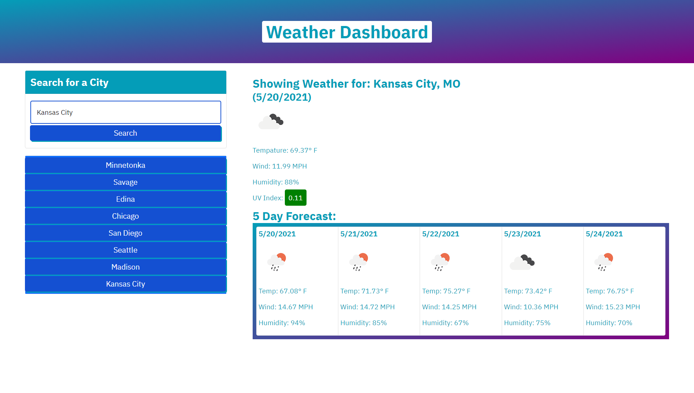

# Druid
This is an up to date weather dashboard

## Image

### Specifications

* User can search API database by city location

* When a user clicks on the search button, search is saved to local file and button is created to repeat action

* When a user reloads the page the information is pulled from the local file

* Automatically update a 5 day weather forcast from one call API 

#### link to live

## 💡 Notes/references 
https://mycolor.space/gradient3?ori=to+right&hex=%23049DB8&hex2=%231D1DC0&hex3=%23A60082&submit=submit
https://getbootstrap.com/docs/4.1/components/buttons/
https://getbootstrap.com/docs/4.0/components/card/
https://openweathermap.org/api/one-call-api
https://www.w3schools.com/jquery/jquery_dom_get.asp
